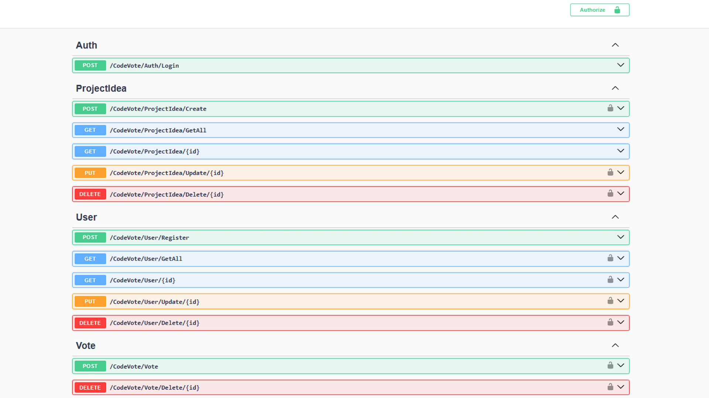

# 🗳️ CodeVote

**CodeVote API** is a RESTful web API built with ASP.NET Core that enables users to register, authenticate using JWT, and submit/vote for project ideas.

---

## 🔧 Tech Stack

- **Framework:** ASP.NET Core (.NET 9)
- **Authentication:** JWT (JSON Web Token)
- **ORM:** Entity Framework Core
- **Database:** SQL Server
- **Logging:** Serilog

---

## 🚀 Features

- ✅ User registration with hashed passwords
- 🔐 JWT-based login & authentication
- 📮 CRUD for users and project ideas
- 🧪 Fully async operations with EF Core
- 📦 DTO pattern with AutoMapper 

---

## 📜 Swagger documentation for API endpoints

---

## 🛠️ Getting Started

1. **Clone the repository**
	- git clone https://github.com/zeleron7/CodeVote
	
2. **Set up the database**
	- Ensure you have SQL Server installed and running.
	- Update the connection string in `appsettings.json` (User Secrets works aswell).
	- run "dotnet ef database update" to apply migrations 

3. **Run the application**
	- Register a new user via the `/api/auth/register` endpoint.
	- Login using `/api/auth/login` to receive a JWT token.
	- Authorize in the top right corner of Swagger UI with the token.

